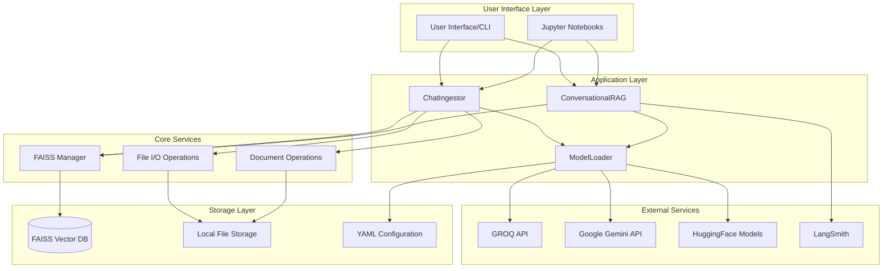
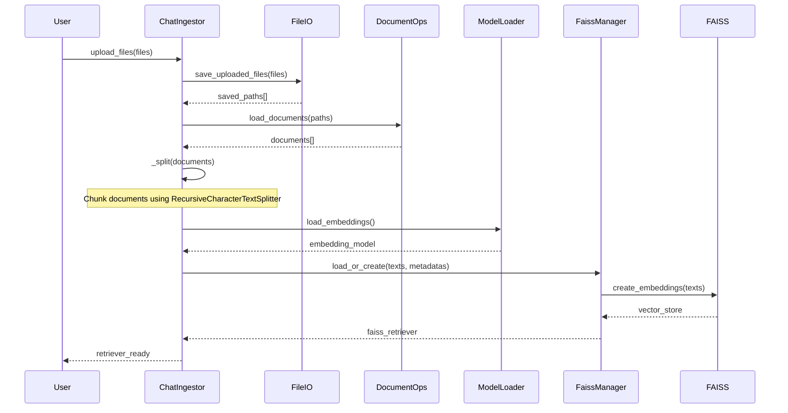
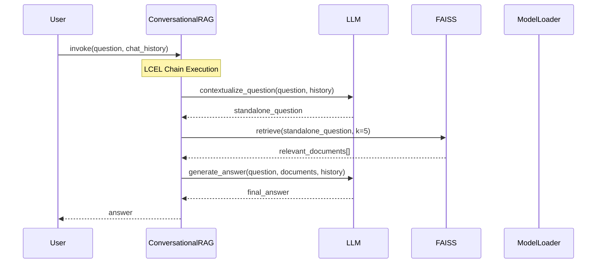

# Multi-Document RAG Chat System - Architecture Documentation

## Table of Contents
1. [Project Overview](#project-overview)
2. [System Architecture](#system-architecture)
3. [Core Components](#core-components)
4. [Data Flow](#data-flow)
5. [Component Interactions](#component-interactions)
6. [Configuration System](#configuration-system)
7. [Evaluation Framework](#evaluation-framework)
8. [Usage Examples](#usage-examples)
9. [Extension Points](#extension-points)

## Project Overview

This is a **Retrieval-Augmented Generation (RAG) system** designed for multi-document conversational AI. The system allows users to:

- **Upload multiple documents** (PDF, DOCX, TXT)
- **Create vector embeddings** from document content
- **Store embeddings** in FAISS vector database
- **Have conversations** with the documents using natural language
- **Maintain chat history** for contextual conversations
- **Evaluate system performance** using LangSmith

### Key Features
- **Session-based document management**
- **Multiple embedding providers** (HuggingFace, Google Gemini)
- **Multiple LLM providers** (GROQ, Google Gemini)
- **Advanced retrieval strategies** (MMR, Similarity Search)
- **Conversational context preservation**
- **Comprehensive logging and error handling**
- **Performance evaluation framework**

## System Architecture



## Core Components

### 1. ChatIngestor (`multi_doc_chat/src/document_ingestion/data_ingestion.py`)

**Purpose**: Handles document ingestion, processing, and FAISS index creation.

**Key Responsibilities**:
- Document upload and validation
- Text chunking and splitting
- Embedding generation
- FAISS index creation and management
- Session management

**Key Methods**:
```python
class ChatIngestor:
    def __init__(self, temp_base="data", faiss_base="faiss_index", use_session_dirs=True)
    def built_retriver(self, uploaded_files, chunk_size=1000, chunk_overlap=200, k=5)
    def _split(self, docs, chunk_size, chunk_overlap)
```

**Usage Flow**:
1. Initialize with session parameters
2. Accept uploaded files
3. Save files to temporary directory
4. Load documents using appropriate loaders
5. Split documents into chunks
6. Generate embeddings
7. Create/update FAISS index
8. Return configured retriever

### 2. ConversationalRAG (`multi_doc_chat/src/document_chat/retrieval.py`)

**Purpose**: Handles conversational interactions with the indexed documents.

**Key Responsibilities**:
- Query contextualization using chat history
- Document retrieval from FAISS
- Answer generation using LLM
- LCEL (LangChain Expression Language) chain orchestration

**Key Methods**:
```python
class ConversationalRAG:
    def __init__(self, session_id, retriever=None)
    def load_retriever_from_faiss(self, index_path, k=5, search_type="mmr")
    def invoke(self, user_input, chat_history=[])
    def _build_lcel_chain(self)
```

**LCEL Chain Structure**:
```python
# 1. Contextualize user question based on chat history
contextualize_chain = contextualize_prompt | llm | StrOutputParser()

# 2. Retrieve relevant documents
retrieval_chain = {
    "context": itemgetter("input") | retriever | format_docs,
    "input": itemgetter("input"),
    "chat_history": itemgetter("chat_history")
}

# 3. Generate final answer
rag_chain = qa_prompt | llm | StrOutputParser()

# 4. Complete chain
self.chain = contextualize_chain.assign(input=itemgetter("input")) | retrieval_chain | rag_chain
```

### 3. ModelLoader (`multi_doc_chat/utils/model_loader.py`)

**Purpose**: Manages LLM and embedding model loading with multiple provider support.

**Key Components**:

#### ApiKeyManager
- Validates and manages API keys for different providers
- Required keys: `GROQ_API_KEY`, `GOOGLE_API_KEY`

#### ModelLoader
- Loads embedding models (HuggingFace, Google)
- Loads LLM models (GROQ, Google)
- Configuration-driven model selection

**Supported Providers**:
```python
# Embedding Models
- HuggingFace: "all-MiniLM-L6-v2" (free, local)
- Google: "models/gemini-embedding-001" (API-based)

# LLM Models  
- GROQ: "openai/gpt-oss-20b"
- Google: "gemini-2.0-flash"
```

### 4. Document Operations (`multi_doc_chat/utils/document_ops.py`)

**Purpose**: Handles document loading with multiple format support.

**Supported Formats**:
- **PDF**: PyPDFLoader
- **DOCX**: Docx2txtLoader  
- **TXT**: TextLoader

**Key Functions**:
```python
def load_documents(paths: Iterable[Path]) -> List[Document]
class FastAPIFileAdapter  # For web uploads
```

### 5. File I/O Operations (`multi_doc_chat/utils/file_io.py`)

**Purpose**: Manages file upload, validation, and storage.

**Key Functions**:
```python
def save_uploaded_files(uploaded_files, target_dir) -> List[Path]
```

**File Handling**:
- Generates unique filenames using UUID
- Validates file extensions
- Creates directory structure
- Handles multiple upload sources (Streamlit, FastAPI, local files)

### 6. FAISS Manager (`multi_doc_chat/src/document_ingestion/data_ingestion.py`)

**Purpose**: Manages FAISS vector database operations.

```python
class FaissManager:
    def __init__(self, index_dir, emb, index_name="index")
    def load_or_create(self, texts, metadatas)
    def save(self)
    def load_retriever(self, k=5, search_type="mmr", fetch_k=20, lambda_mult=0.5)
```

**Features**:
- **Load or Create**: Loads existing index or creates new one
- **Multiple Search Types**: 
  - `similarity`: Standard cosine similarity
  - `mmr`: Maximal Marginal Relevance (diversity + relevance)
  - `similarity_score_threshold`: Threshold-based filtering
- **Persistence**: Saves index and metadata to disk

## Data Flow

### Document Ingestion Flow



### Conversational Query Flow



## Component Interactions

### 1. Session Management
- **Session ID Generation**: `session_YYYYMMDD_HHMMSS_<8-char-uuid>`
- **Directory Structure**:
  ```
  data/session_20241024_143052_a1b2c3d4/
  faiss_index/session_20241024_143052_a1b2c3d4/
    ├── index.faiss
    ├── index.pkl  
    └── ingested_meta.json
  ```

### 2. Configuration Management
- **YAML-based configuration**: `multi_doc_chat/config/config.yaml`
- **Environment variable support**: `.env` file loading
- **Runtime configuration**: Provider switching via `LLM_PROVIDER` env var

### 3. Error Handling & Logging
- **Custom Exception**: `DocumentPortalException`
- **Structured Logging**: JSON-formatted logs with timestamps
- **Graceful Degradation**: Fallback mechanisms for API failures

### 4. Memory Management
- **Lazy Loading**: Models loaded only when needed
- **File Handle Management**: Proper cleanup of file resources
- **Session Isolation**: Separate storage per session

## Configuration System

### Configuration File Structure (`config/config.yaml`)

```yaml
embedding_model:
  provider: "huggingface"  # or "google"
  model_name: "all-MiniLM-L6-v2"

retriever:
  top_k: 10
  search_type: "mmr"
  fetch_k: 20
  lambda_mult: 0.5

llm:
  groq:
    provider: "groq"
    model_name: "openai/gpt-oss-20b"
    temperature: 0
    max_output_tokens: 2048
  google:
    provider: "google" 
    model_name: "gemini-2.0-flash"
    temperature: 0
    max_output_tokens: 2048
```

### Environment Variables
```bash
# Required API Keys
GROQ_API_KEY=your_groq_api_key
GOOGLE_API_KEY=your_google_api_key

# Optional Configuration
LLM_PROVIDER=google  # or groq
CONFIG_PATH=custom/config/path.yaml
FAISS_INDEX_NAME=custom_index_name
```

## Evaluation Framework

### LangSmith Integration (`notebook/evaluations.ipynb`)

The system includes a comprehensive evaluation framework:

#### 1. Dataset Creation
```python
# Golden dataset with question-answer pairs
inputs = ["Question 1", "Question 2", "Question 3"]
outputs = ["Expected Answer 1", "Expected Answer 2", "Expected Answer 3"]

# Store in LangSmith
dataset = client.create_dataset(
    dataset_name="LLMOPS_Dataset",
    description="Input and expected output pairs for evaluations"
)
```

#### 2. RAG Function Testing
```python
def answer_ai_report_question(inputs: dict, data_path: str, ...) -> dict:
    # Complete RAG pipeline for evaluation
    # Returns {"answer": "generated_response"}
```

#### 3. Custom Gemini Evaluator
```python
def gemini_qa_evaluator(run: Run, example: Example) -> dict:
    # Uses Gemini to evaluate answer quality
    # Scores on accuracy, completeness, relevance
    # Returns score (0-1) and reasoning
```

#### 4. Evaluation Execution
```python
experiment_results = evaluate(
    answer_ai_report_question,
    data=dataset_name,
    evaluators=[gemini_qa_evaluator],
    experiment_prefix="test-rag-system"
)
```

## Usage Examples

### 1. Basic Document Chat (`test.py`)

```python
from multi_doc_chat.src.document_ingestion.data_ingestion import ChatIngestor
from multi_doc_chat.src.document_chat.retrieval import ConversationalRAG

# 1. Initialize ingestion
ci = ChatIngestor(temp_base="data", faiss_base="faiss_index", use_session_dirs=True)

# 2. Upload and process documents
uploaded_files = [open("document.pdf", "rb")]
retriever = ci.built_retriver(
    uploaded_files, 
    chunk_size=200, 
    chunk_overlap=20, 
    k=5,
    search_type="mmr",
    fetch_k=20,
    lambda_mult=0.5
)

# 3. Initialize RAG system
rag = ConversationalRAG(session_id=ci.session_id)
rag.load_retriever_from_faiss(
    index_path=f"faiss_index/{ci.session_id}", 
    k=5,
    search_type="mmr"
)

# 4. Interactive chat
chat_history = []
while True:
    user_input = input("You: ")
    if user_input.lower() == 'exit':
        break
    
    answer = rag.invoke(user_input, chat_history=chat_history)
    print("Assistant:", answer)
    
    # Maintain conversation context
    chat_history.append(HumanMessage(content=user_input))
    chat_history.append(AIMessage(content=answer))
```

### 2. Evaluation Workflow (`notebook/evaluations.ipynb`)

```python
# 1. Create evaluation dataset
qa_pairs = [{"question": q, "answer": a} for q, a in zip(inputs, outputs)]
df = pd.DataFrame(qa_pairs)

# 2. Store in LangSmith
dataset = client.create_dataset(dataset_name="LLMOPS_Dataset")
client.create_examples(inputs=inputs, outputs=outputs, dataset_id=dataset.id)

# 3. Test RAG function
result = answer_ai_report_question({"question": "What is RAG?"})

# 4. Run evaluation with custom evaluator
experiment_results = evaluate(
    answer_ai_report_question,
    data="LLMOPS_Dataset", 
    evaluators=[gemini_qa_evaluator]
)
```

### 3. Custom Configuration

```python
# Load with custom config
os.environ["CONFIG_PATH"] = "custom_config.yaml"
os.environ["LLM_PROVIDER"] = "groq"

# Initialize with custom settings
ci = ChatIngestor(
    temp_base="custom_data",
    faiss_base="custom_index", 
    use_session_dirs=False,
    session_id="custom_session"
)
```

## Extension Points

### 1. Adding New Document Types

```python
# In document_ops.py
def load_documents(paths: Iterable[Path]) -> List[Document]:
    # Add new format support
    elif ext == ".pptx":
        loader = UnstructuredPowerPointLoader(str(p))
    elif ext == ".csv":
        loader = CSVLoader(str(p))
```

### 2. Adding New Embedding Providers

```python
# In model_loader.py
def load_embeddings(self):
    provider = self.config["embedding_model"].get("provider")
    
    if provider == "openai":
        return OpenAIEmbeddings(
            model=model_name,
            api_key=self.api_key_mgr.get("OPENAI_API_KEY")
        )
    elif provider == "cohere":
        return CohereEmbeddings(
            model=model_name,
            cohere_api_key=self.api_key_mgr.get("COHERE_API_KEY")
        )
```

### 3. Adding New LLM Providers

```python
# In model_loader.py  
def load_llm(self):
    if provider == "anthropic":
        return ChatAnthropic(
            model=model_name,
            anthropic_api_key=self.api_key_mgr.get("ANTHROPIC_API_KEY"),
            temperature=temperature
        )
```

### 4. Custom Retrieval Strategies

```python
# In retrieval.py
def load_retriever_from_faiss(self, search_type="custom"):
    if search_type == "custom":
        # Implement custom retrieval logic
        return self.vs.as_retriever(
            search_type="similarity_score_threshold",
            search_kwargs={"score_threshold": 0.8}
        )
```

### 5. Custom Evaluation Metrics

```python
# Custom evaluator function
def custom_evaluator(run: Run, example: Example) -> dict:
    # Implement custom evaluation logic
    return {
        "key": "custom_metric",
        "score": calculated_score,
        "reasoning": evaluation_reasoning
    }
```

## Key Design Patterns

### 1. **Factory Pattern**
- `ModelLoader` acts as a factory for different LLM and embedding providers
- Dynamic provider selection based on configuration

### 2. **Adapter Pattern**
- `LocalFileAdapter`, `FastAPIFileAdapter` adapt different file sources
- Consistent interface for various upload mechanisms

### 3. **Session Pattern**
- Isolated sessions for multi-user scenarios
- Unique session IDs with timestamp and UUID

### 4. **Chain of Responsibility**
- LCEL chains for processing user queries
- Modular processing stages (contextualize → retrieve → generate)

### 5. **Configuration Pattern**
- External YAML configuration for easy customization
- Environment variable overrides for deployment flexibility

## Performance Considerations

### 1. **Embedding Generation**
- Local HuggingFace models for cost-effective embeddings
- Batch processing of documents for efficiency

### 2. **Vector Search**
- FAISS for fast similarity search
- MMR for diversity in retrieved results
- Configurable search parameters (k, fetch_k, lambda_mult)

### 3. **Memory Management**
- Lazy loading of models and retrievers
- Session-based data isolation
- Proper cleanup of file handles

### 4. **Caching**
- FAISS index persistence across sessions
- Metadata caching for quick retrieval setup

This architecture provides a robust, scalable, and extensible foundation for building conversational RAG systems with comprehensive evaluation capabilities.